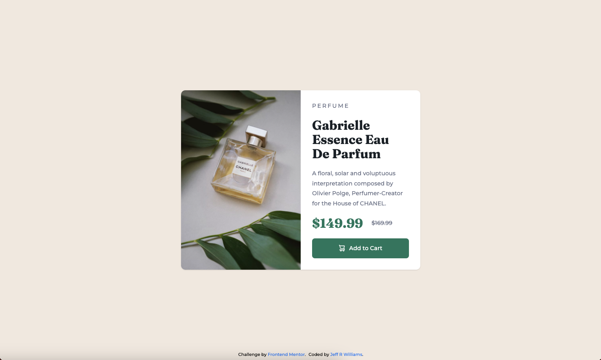

# Frontend Mentor - Product preview card component solution

This is a solution to the [Product preview card component challenge on Frontend Mentor](https://www.frontendmentor.io/challenges/product-preview-card-component-GO7UmttRfa). Frontend Mentor challenges help you improve your coding skills by building realistic projects.

## Table of contents

- [Overview](#overview)
  - [The challenge](#the-challenge)
  - [Screenshot](#screenshot)
  - [Links](#links)
  - [Built with](#built-with)
- [Author](#author)

## Overview

### The challenge

Users should be able to:

- View the optimal layout depending on their device's screen size
- See hover and focus states for interactive elements

### Screenshot

### Links

- Solution URL: [GitHub Repo](https://github.com/orphandeity/product-preview-card-component.git)
- Live Site URL: [GitHub Pages](https://orphandeity.github.io/product-preview-card-component)

### Built with

- [React](https://reactjs.org/) - JS library
- [Vite](https://vitejs.dev/) - Frontend Tooling
- [TailwindCSS](https://tailwindcss.com/) - For styles

## Author

- Frontend Mentor - [@orphandeity](https://www.frontendmentor.io/profile/orphandeity)
